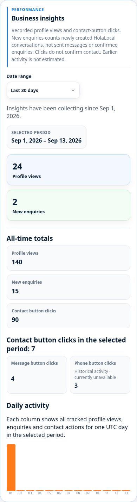
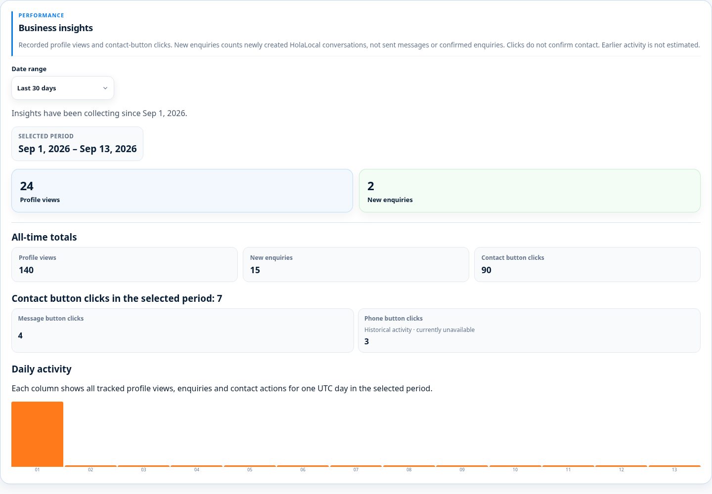

# Business insights: contact availability and honest metrics

Website-only candidate from main 6ba0d27212319699197a18306b7bbf47b69f7681. No backend, permission, contact-setting, tracking, Analytics or activation changes.

## What the counters mean

- Profile views: recorded eligible public-profile view events, with the existing session token/deduplication and rate limits. Not a count of unique people.
- New enquiries: `countCreatedConversation` in `functions/src/businessInsights.js`, invoked by the existing conversation-created trigger, counts a newly created business conversation once. It does not count sent messages or prove a genuine enquiry. Reopening a conversation is not a new conversation.
- Former “HolaLocal messages”: contact_action/holalocal increments when the Message business button is tapped. Now labelled “Message button clicks”. Phone/email/WhatsApp/website counts are likewise clicks, not confirmed contact or delivery.
- Callback availability has no corresponding collected metric; this change does not invent one.

## Authoritative implementation

`firebaseCompatibility.js` derives the owner's read-only `publicContact` projection from the raw business document using the existing shared `isPublicBusinessEligible` and existing public-contact projector. Private owner contact overrides cannot make a channel available in insights. Invalid, unpublished, suspended and deletion-pending public profiles have no available public contacts.

`BusinessInsightsPanel.jsx` receives that projection from the existing dashboard. It shows a channel if available now OR if its selected-period count is positive. Historical activity on unavailable channels is labelled. Unavailable zero-count channels and empty breakdown sections are absent. Selected-period contact-click totals and all-time totals remain supplied by the existing service, including historical counts, without recomputation/filtering.

The two headline cards retain Profile views/New enquiries. Original CSS rules now use two desktop headline columns and flexible contact tiles. Removed the obsolete third-card accent rule. Replaced the chart's undefined `--brand-coral` reference with the existing brand-orange token. No override layer or replacement component.

Affected metric wording is translated in all 17 original locale resources. Existing unrelated labels retain their current translations/fallback behaviour. Automated locale/layout verification is not native-speaker editorial review.

## Verification

- 29 insights/locale-composition tests pass.
- The new actual managed/public projection regression passes, including private overrides, hidden values, lifecycle and deletion state.
- Full compatibility suite: 30 pass, 7 fail. Unchanged main-equivalent source with the same dependencies: 29 pass, the same 7 fail. These are existing broader locale manifest/composition/legal assertions; no coverage suppressed or changed to mask them.
- 46 local browser checks: 390/1440 widths, messaging-only, multiple channels, unavailable historical counts, inactive business, empty/error, period change, reload, keyboard focus, 17-language wrapping. All external requests blocked; zero external requests occurred.
- Lint, locale parity (17), fresh production build and unchanged 200 kB budget pass. Local initial JS: 190.17 kB gzip; Vercel's configured preview build may differ.

Synthetic fixtures exist only in `tests/browser/businessInsights.mjs`, loaded by a programmatic test server. They are not imported into runtime pages or the production build. Run from apps/holalocal-website:

```
node tests/browser/businessInsights.mjs
node tests/browser/businessInsights.mjs --serve
```

Interactive local preview: http://127.0.0.1:4198/insights-preview?scenario=historical
Other scenarios: messaging, multiple, inactive, empty, error. Locale uses the existing local UI-language preference.




## Release boundary

Appearance approval and production merge remain pending. The PR's automatic Vercel preview uses actual guarded application routes, without synthetic fixtures. No production tracking traffic was generated. No Firebase deployment is required. Preserve current production environment and review/translation/retention/Analytics settings. Original mixed workspace, older insights branch and backups remain untouched.
